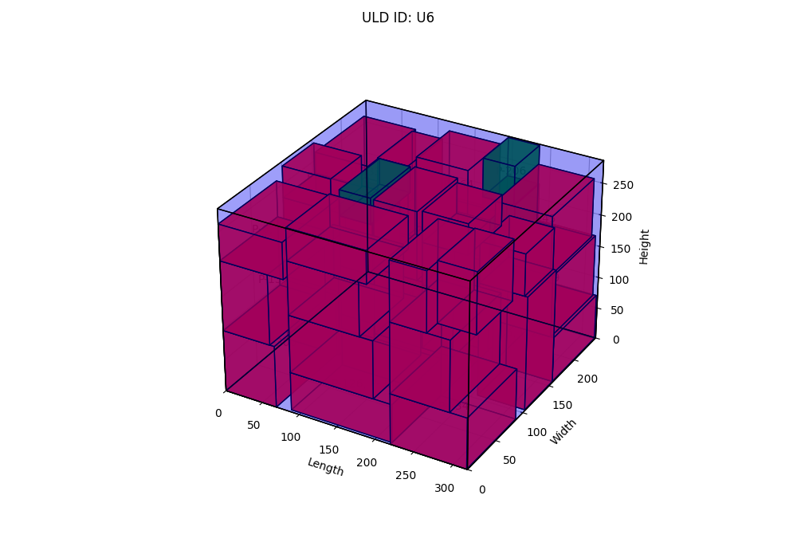

# 3D Bin Packing - FedEx

This is the implementation of the paper : " Constrained Optimization in a 3D bin packing realistic problem " , modified to our use case, developed by our team at the 13th Inter IIT Tech Meet held at IIT Bombay. 

## Problem Description

The challenge involves loading 400 packages (a mix of "Priority" and "Economy" types) into 6 available ULDs. The objective is to:
 -  Ensure all Priority packages are loaded.
 -  Minimize the total cost, which comprises:
    *   A penalty (`K = 5000`) for each ULD that contains at least one Priority package (cost of spreading).
    *   The "Cost of Delay" for any Economy packages that are not loaded.

The input data includes ULD dimensions and weight limits, and package dimensions, weight, type, and cost of delay (for Economy packages).

## Features

-   **3D Bin Packing Algorithm:** Implements a heuristic-based approach to place packages within ULDs, considering multiple orientations.
-   **Cost Optimization:** Aims to minimize the combined cost of priority package spread and unplaced economy packages.
-   **Priority Package Handling:** Prioritizes the placement of all "Priority" type packages.
-   **"Super-Item" Heuristic:** Combines smaller, dimensionally compatible packages into larger "super items" to improve packing efficiency.
-   **Multi-Pass Placement:** Uses different strategies and heuristics in multiple passes to fill ULD space effectively.
-   **Data Preprocessing:** Sorts ULDs and packages based on custom fitness functions.
-   **Solution Improvement:** Can load a previously saved solution and attempt to further optimize it.
-   **Multiprocessing:** Utilizes multiple CPU cores to speed up the iterative search for the best placement.
-   **3D Visualization:** Generates 3D plots of the packed ULDs using Matplotlib for visual inspection.
-   **Result Persistence:** Saves the best-found solution to a CSV file (`Final_Placements.csv`).

## Algorithm Details

-   **Height Map:** A 2D NumPy array is used for each ULD to track the current top surface height, preventing overlaps.
-   **Potential Points:** The algorithm considers corners of the ULD and corners of already placed boxes as potential starting points for new placements.
-   **Local Placement Cost:** A heuristic function evaluates the "goodness" of placing a single box at a specific location, considering factors like gap minimization and surface contact.
-   **Iterative Search:** The placement algorithms run for a specified number of iterations (default 100), often in parallel, to explore different packing sequences and find a near-optimal solution.

## Results

- Total Leaving Cost: 33,160.0
- Total Packages Fitted: 208 (out of 400)
- Priority Packages: All 88 priority packages successfully placed.
- Average ULD Weight Utilization: ~72%
- Average ULD Volume Utilization: ~70%

## Visualizations

Below are the packed ULDs :

